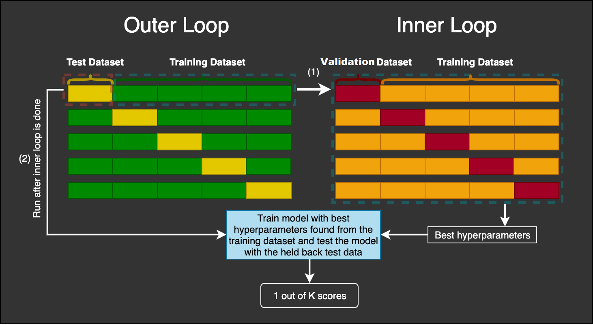
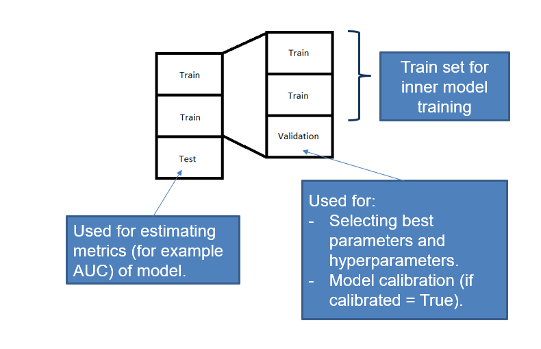

# Introduction

This is a Python package that provides an easy way to do **Nested Cross Validation** for **hyperparameter tuning** and **model evaluation** on classification problems.

It is specially designed for binary or multiclass classification problems where either there is an imbalance problem or probability calibration is very important (or both). 

# Overview

nestedcvtraining is built on top of three packages:

- scikit-learn.
- imbalanced-learn.
- scikit-optimize.

In a machine learning flow, this package helps with automating hyperparameter optimization, model validation and model training. 

There are two main aspects that are simplified with the API proposed by the package. First, you need only to call one function after defining carefully your model (including preprocessing if you wish) and your search space (including all hyperparameters of the model and the search space as you want). Second, you can decide if you want to calibrate your model and how, using the same API. 

In addition to that, the package includes two new classes:

- An UnderSamplingClassifier, an *estimator* that creates a model ensemble by trainng several models using all samples from the minority class and several stratified splits of the rest of samples.
- A SwitchCase, a *composite* object that helps with defining the model and search space in a much more modular and easier way.

# How it works

Before any explanation, taking a look at this picture will be very helpful:

Nested Cross Validation Scheme

Image taken from [here](https://mlfromscratch.com/nested-cross-validation-python-code), a good source of Machine Learning explanations.

In Nested Cross Validation we have two (or three, in some sense) nested for loops. The easiest way to understand the procedure is by dividing the problem in two: First, let's think that we have a *black-box* that, given a pair (X, y) of training data, a model configuration and a hyperparameter search space, outputs a fitted model. And we are interested in measuring how good or bad is this black box with respect to a given set of metrics. For example, what accuracy can we expect for a model that this *black-box* produces?

In order to measure this (or any other) metric, as the process is stochastic, we don't expect to get only a number, but some kind of interval or at least an estimate of the standard deviation of the error. And of course we want to have an unbiased estimation. This is exactly the goal of the outer loop: the outer loop runs several times with different folds, which are just splits (X_train, y_train), (X_test, y_test), and for each one, it executes the *black-box* procedure on the training set, and it evaluates the model on the test set. Having disjoint splits ensures that the estimate of the metric is unbiased (unless there is another source of data leakage), and doing it repeatedly reduces the error and provide an estimate of the standard deviation.

Let's consider now the *black-box*: the purpose of it is to build a model given a pair (X, y) (that comes from a (X_train, y_train) of the outer loop), a model configuration and a search space. There are several ways of doing it, but essentially it all boils down to something like this: 

- We test iteratively (be it at random, using a grid, using a more clever procedure like bayesian gaussian process) several combinations of hyperparameters. 
- For each combination of hyperparameters, we train a model. But, we need a measure of how good/bad the model is, in order to select at the end the best combination of hyperparameters. We could do it using a single split (splitting (X, y) into (X_train, y_train) and (X_validation, y_validation)). But we would be at the mercy of too much randomness (specially if our dataset is not too big). So, instead of relying on a single number, we can do the same trick: cross validate the metric using several splits and assign the mean value to the hyperparameter combination.
- We select the combination that performs better with respect to the metric (averaged over all folds we have considered).
- We train a new model instance with those hyperparameters on the whole (X, y). And this is the model that the *black-box* outputs, that is, the model that will be evaluated on the (X_test, y_test) of the outer loop. 

A question that might arise is the following: given this procedure, we end up with several (not only one) *best* hyperparameters. How can get one model at the end? Well, we will apply the same optimizing procedure (what we called the *black-box*) after ending the outer loop using the full dataset (X, y). In this point, the advantage of having done every step before is that we can estimate how good is this model, even if we don't have a test set for it. 

It is possible that we want to calibrate the probabilities of the model as well. In this case, we could use `CalibratedClassifierCV`, but this meta-estimator needs either a new dataset or it performs, inside, a cross validation to build an ensemble of models (this is because probablity calibration cannot be done using the same training data). In this case, we provide two options: 

- Either wrap all models by the `CalibratedClassifierCV`, which, under the hood, will imply that we are doing a triple nested cross validation (which is computationally very expensive).
- Or wrap only the best model in the last step of the inner loop, so that this is the only model that is calibrated, and both the quality of the predicitons and the quality of the calibration can be tested against the outer test set. We recommend this option, taking into account that probability calibration tends not to alter model ranking, so it should not interfere in the hyperparameter optimization. 

I tried to be consistent in the documentation and the code and follow the nomenclature that considers that:

- In the outer loop, we split (X, y) in several folds, and we call each of the splits (X_outer_train, y_outer_train), (X_outer_test, y_outer_test)
- In the inner loop, we split (X_outer_train, y_outer_train) in several folds, and we call each of the splits (X_inner_train, y_inner_train), (X_inner_validation, y_inner_validation)

For example, if both k_outer_folds and k_inner_folds where 3, as in the previous scheme, then the algorithm will run 3 outer loops and 3 inner loops, so in total 9 * (number of calls of the optimizing procedure that tries different hyperparameters) partial inner models will be fitted, 3 full inner models will be fitted, returned by the inner loop (i.e. the *black-box*) and evaluated on the test set and a final model will be fitted and returned by the main function. I hope this is clear at this stage! 

# Principles 

This package follows all these rules and recommended practices:

1. You should only use a Cross Validation step for one thing: either for model selection, either for estimating the error of the model. If you use it for both things, you are at risk of underestimating the error of the model (overfitting bias). 
2. Every part of the pipeline that uses the whole dataset (for example, PCA, normalization, feature selection based on variance or information gain with respect to the target), should be done inside the cross validation, that is, fitting the component only with the train set, and transforming the test/validation set accordingly in the same fashion. If this care is not taken, there is risk of understimating the error of the model due to data leakage. This is why in all examples we recommend to wrap the model and the pipeline in a single object (which tipically will be a `sklearn` or `imblearn` `Pipeline`). 
3. If you use cross validation for model selection, once you have checked that the model selection procedure is good (i.e. it has low variance, the metric scores are well enough), then you should apply it the same way to the whole dataset.

# Story behind nestedcvtraining

When working on a classification project where we wanted to get a calibrated probability prediction, I found it wasn't very easy to do the following things at once:

- Searching for best parameters of model (and of post-process pipeline if possible).
- Training a model.
- Calibrating the model.
- Assessing the quality of the model.

The reason is that the class `CalibratedClassifierCV` needs an independent dataset in order to calibrate the base model. So if you want to perform a nested cross validation loop to separate the optimization procedure from the quality assessment, it's not easy to implement. That's why I decided to simplify the procedure, and later I added extra functionality. It's still a work in progress, but a lot have changed from the first version (that was very poorly design from a software perspective). There are still lots of things to be improved, but now I feel more more confident about it. 

